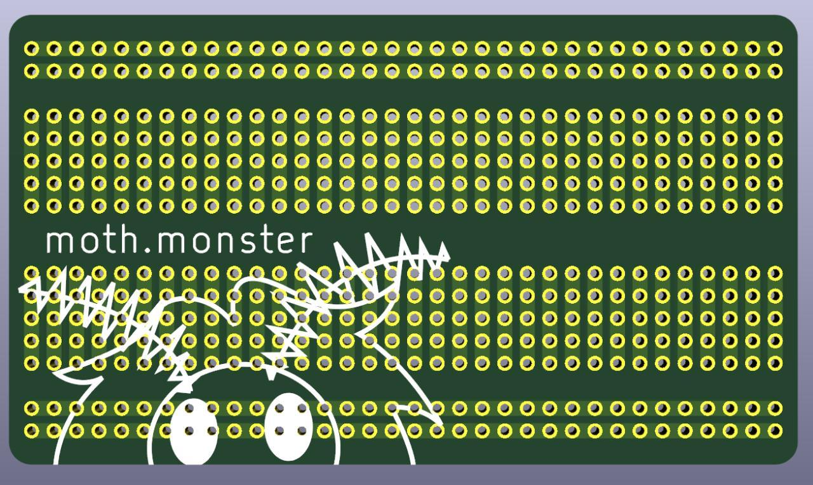

# Breadboard Business Card
A business card sized breadboard/protoboard PCB. I thought that most business cards focus way too hard on the novelty aspect, leading to something that will be enjoyed for a short period before being thrown away. This one is intended to be more practical, something they'll actually keep and use.

The included version does not contain any branding, and you are free to add your own. I'd recommend using [svg2shenzhen](https://github.com/badgeek/svg2shenzhen) to convert your logo to a Kicad component, then place it on the board along with whatever text you want.

This work is licensed under a
[Creative Commons Attribution-ShareAlike 4.0 International License][cc-by-sa].

[![CC BY-SA 4.0][cc-by-sa-image]][cc-by-sa]

[cc-by-sa]: http://creativecommons.org/licenses/by-sa/4.0/
[cc-by-sa-image]: https://licensebuttons.net/l/by-sa/4.0/88x31.png
